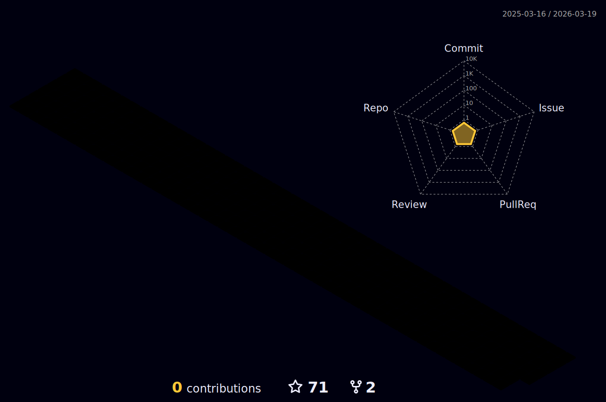

<h1  align='center'>
  
  
</h1>

### 💻 𝕃𝕒𝕟𝕘𝕦𝕒𝕘𝕖 𝕒𝕟𝕕 𝕋𝕠𝕠𝕝𝕤:  

  

 

  
  
  
  

  

  
  

  

  
  
  
  
  
 
  
   

  
  
  
  
  
  

 

<!--  -->

&nbsp;  
### 🎓 𝔼𝕕𝕦𝕔𝕒𝕥𝕚𝕠𝕟:  
  - Master of Physico-mathematical Sciences
  - [Coursera Certificates](https://github.com/anysofronova/Coursera-Certificates/blob/main/README.md)
    - JavaScript for Beginners Specialization
    - HTML, CSS, and Javascript for Web Developers
    - Web Design for Everybody: Basics of Web Development & Coding Specialization
    - Специализация Разработка интерфейсов: вёрстка и JavaScript

### 💼 ℙ𝕠𝕣𝕥𝕗𝕠𝕝𝕚𝕠:  

### ⚔️ ℂ𝕠𝕕𝕖𝕎𝕒𝕣𝕤:  
  
  

  

### 📱 𝔽𝕠𝕝𝕝𝕠𝕨 𝕞𝕖:  

### ℂ𝕠𝕟𝕥𝕣𝕚𝕓𝕦𝕥𝕚𝕠𝕟𝕤: 

<!-- <h4 align='center'> 📍  𝕀'𝕞 𝕠𝕡𝕖𝕟 𝕥𝕠 𝕟𝕖𝕨 𝕛𝕠𝕓 𝕠𝕡𝕡𝕠𝕣𝕥𝕦𝕟𝕚𝕥𝕚𝕖𝕤  </h4> -->
<!--  -->
<!--  -->
<!--  -->
<!--  -->
<!--  -->
<!--  -->
<!--  -->

